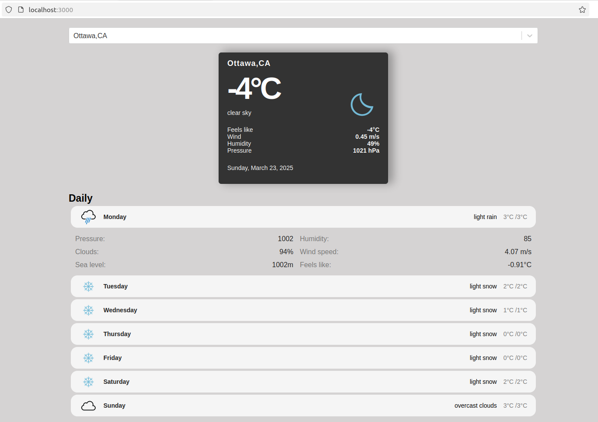

## Screenshot




## MyWeather App

MyWeather App is a containerized application that uses Redis, PostgreSQL, and a React frontend. This README provides instructions on how to set up and run the application using Docker Compose.

## Prerequisites

- Docker
- Docker Compose

## Environment Variables

update the `.env` file in the root of your project to store your environment variables:

```plaintext
REACT_APP_GEO_API_URL=https://wft-geo-db.p.rapidapi.com/v1/geo
REACT_APP_RAPIDAPI_KEY=<your key>
REACT_APP_RAPIDAPI_HOST=wft-geo-db.p.rapidapi.com

WEATHER_API_URL=https://api.openweathermap.org/data/2.5
WEATHER_API_KEY=<your key>
```

## Docker Compose

### Starting the Application

To start the application, run the following command:

```bash
docker-compose up
```

This command will start all the services defined in the `docker-compose.yml` file, including the React frontend, Redis, PostgreSQL, and the backend server.

### Stopping the Application

To stop the application, run the following command:

```bash
docker-compose down
```

This command will stop and remove all the containers defined in the `docker-compose.yml` file.

## Services

### React Frontend

The React frontend is served on port 3000. It uses environment variables to configure the API URLs and headers.

### Redis

Redis is used for caching and is accessible on port 6379.

### PostgreSQL

PostgreSQL is used as the database and is accessible on port 5432. The database credentials are configured using environment variables.

### Backend Server

The backend server is served on port 5001. It uses environment variables to configure the Redis and PostgreSQL connections, as well as the OpenWeatherMap API.

## Logging

The application uses Docker's `json-file` logging driver to store logs. The logs are configured to rotate when they reach 10MB in size, and up to 3 log files are retained.

## Additional Information

This will help keep your sensitive information secure.
```

### Summary:
1. **Environment Variables**: Create a .env file to store environment variables.
2. **Docker Compose Commands**: Include commands to start and stop the application using Docker Compose.
3. **Services**: Describe the services (React frontend, Redis, PostgreSQL, backend server) and their configurations.
4. **Logging**: Explain the logging configuration.
5. **Additional Information**: Ensure the .env file is not committed to version control.

These updates to the README.md file will provide clear instructions on how to set up and run the application, as well as how to manage environment variables and logging.

