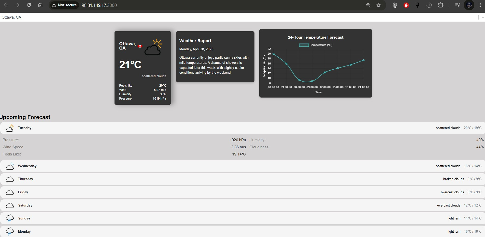
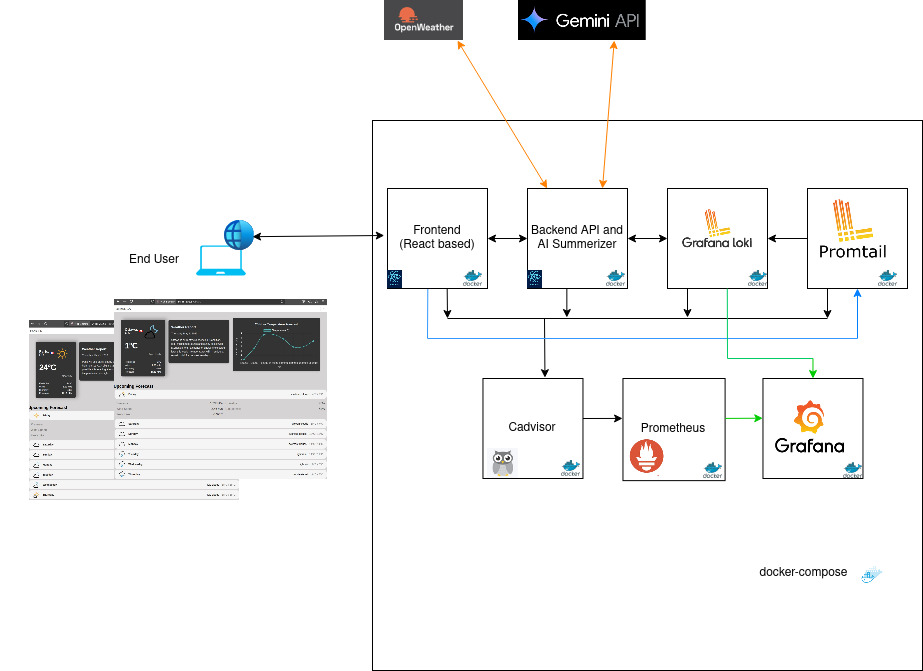
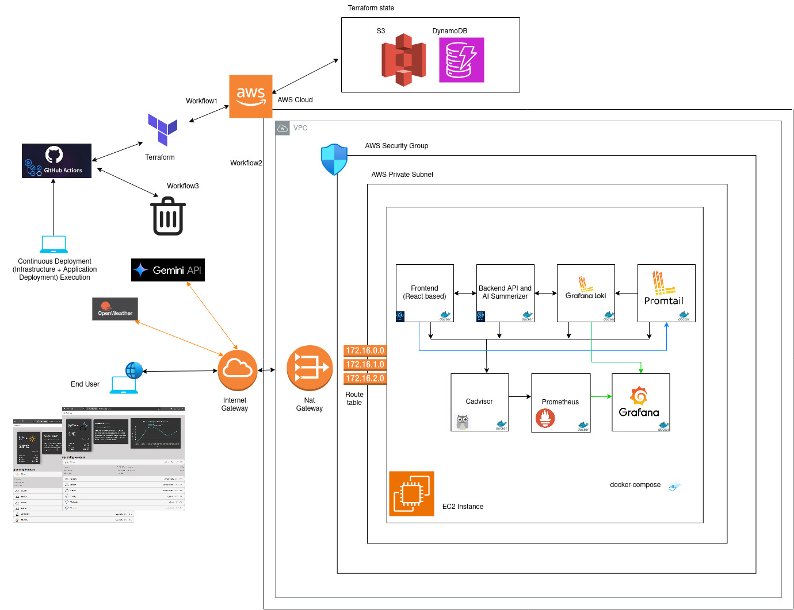
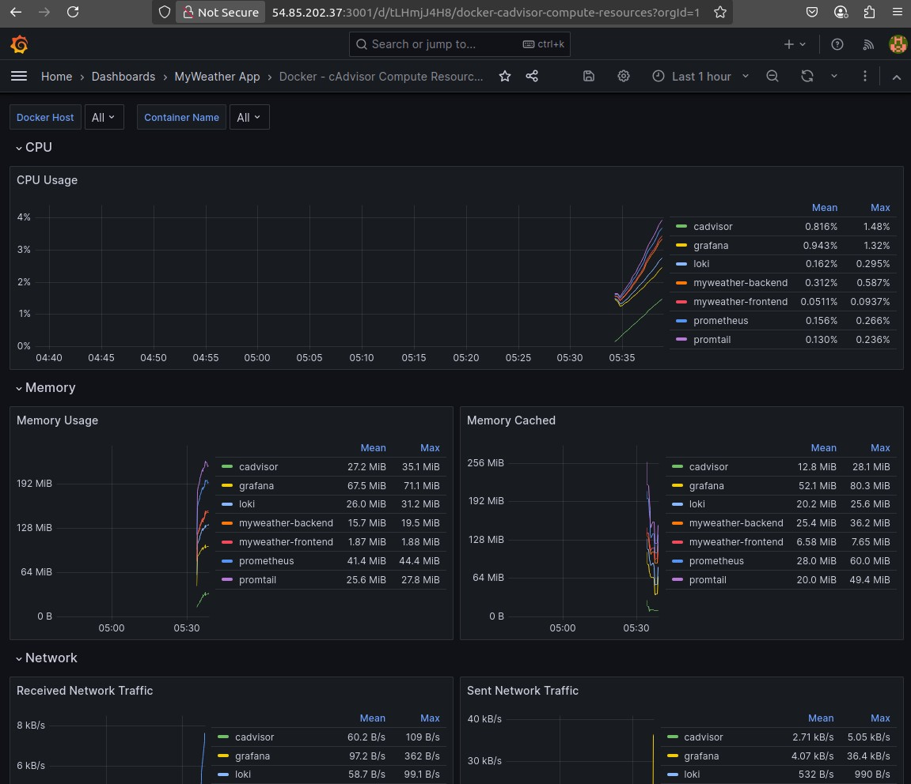
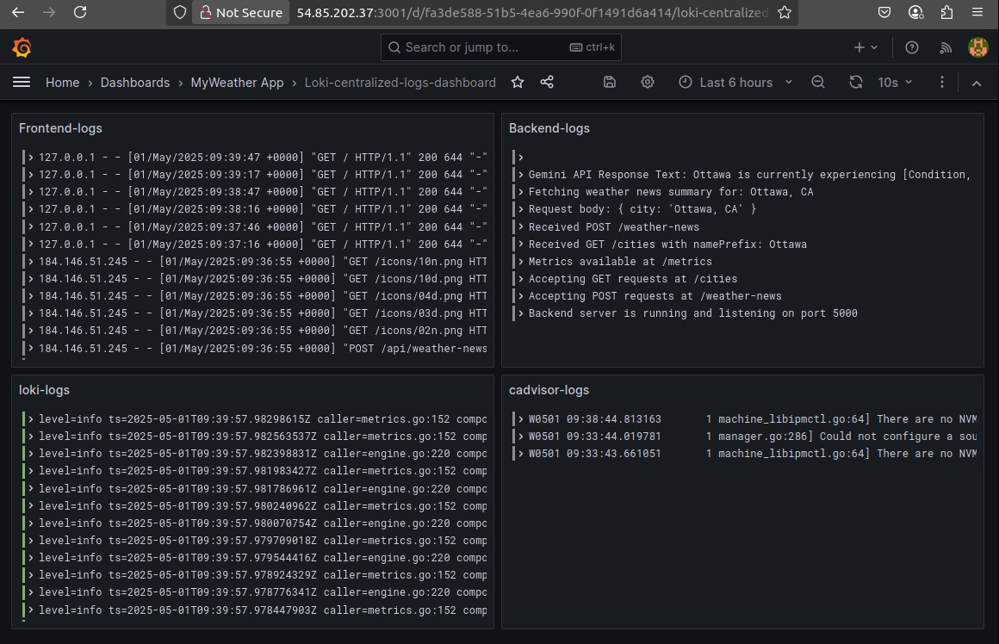

## Screenshot



## MyWeather App

MyWeather App is a containerized application that uses React frontend and Backend made of API calls to fetch realtime Weather data and also Google Gemini AI integrated weather summarizer and monitoring system using prometheus-grafana-loki stack. This README provides instructions on how to set up and run the application using Docker Compose.

## Architecture



## Overall Architecture


## Prerequisites

- Docker
- Docker Compose
Screenshot of the work (./assets/docker-compose-status.jpg)


## Environment Variables

update the `.env` file in the root of your project to store your environment variables:

```plaintext
REACT_APP_GEO_API_URL=https://wft-geo-db.p.rapidapi.com/v1/geo
REACT_APP_RAPIDAPI_KEY=<your key>
REACT_APP_RAPIDAPI_HOST=wft-geo-db.p.rapidapi.com

WEATHER_API_URL=https://api.openweathermap.org/data/2.5
WEATHER_API_KEY=<your key>
```

## Docker Compose

### Starting the Application

To start the application, run the following command:

```bash
docker-compose up
```

This command will start all the services defined in the `docker-compose.yml` file, including the React frontend, Redis, PostgreSQL, and the backend server.

### Stopping the Application

To stop the application, run the following command:

```bash
docker-compose down
```

This command will stop and remove all the containers defined in the `docker-compose.yml` file.

## Services

### React Frontend

The React frontend is served on port 3000. It uses environment variables to configure the API URLs and headers.

### Backend Server

The backend server is served on port 5001. It uses environment variables to configure the Redis and PostgreSQL connections, as well as the OpenWeatherMap API.

### Prometheus

Prometheus is used for monitoring and scraping metrics from the backend, Redis, and PostgreSQL services. It is accessible on port 9090.

- **Configuration**: The Prometheus configuration file (`prometheus.yml`) is mounted into the container.
- **Metrics Endpoint**: Prometheus scrapes metrics from the `/metrics` endpoint exposed by the backend service.

### Grafana

Grafana is used for visualizing metrics collected by Prometheus. It is accessible on port 3001.

- **Default Credentials**:
  - Username: `admin`
  - Password: `admin` (or the value set in the `GF_SECURITY_ADMIN_PASSWORD` environment variable).
- **Prometheus Data Source**:
  - URL: `http://prometheus:9090`
  - URL: `http://loki:3100`
  - I have created and already imported the json file for view prometheus and Loki based dashboard on Grafana to monitoring the container metrics and errors via Grafana dashboard.

  Prometheus datasource based dashboard
  

  Loki datasource based dashboard
  

## Additional Information

Ensure that the `.env` file is not committed to version control by adding it to your `.gitignore` file:

```plaintext
# .gitignore
.env
```

This will help keep your sensitive information secure.
```

### Summary:
1. **Environment Variables**: Create a .env file to store environment variables.
2. **Docker Compose Commands**: Include commands to start and stop the application using Docker Compose.
3. **Services**: Describe the services (React frontend, Redis, PostgreSQL, backend server) and their configurations.
4. **Logging**: Explain the logging configuration.
5. **Additional Information**: Ensure the .env file is not committed to version control.
( Here I have commited for quick application validation)

These updates to the README.md file will provide clear instructions on how to set up and run the application, as well as how to manage environment variables and logging.
```
### Kubernetes Deployment 

kubectl apply -f manifests/staging/namespace.yaml 

## Encrypted secret files are decrypted on the K8s machine but still in the memory to secure API Key

SOPS_AGE_KEY_FILE=./manifests/age.agekey sops --decrypt manifests/staging/backend-secret.yaml | kubectl apply -f -

SOPS_AGE_KEY_FILE=./manifests/age.agekey sops --decrypt manifests/staging/cloud-secret.yaml | kubectl apply -f -

## Deploying

kubectl apply -f manifests/base/*.yaml

## Logs Check

kubectl logs -l app=cloudflare-myweather -n myweather tail=50


