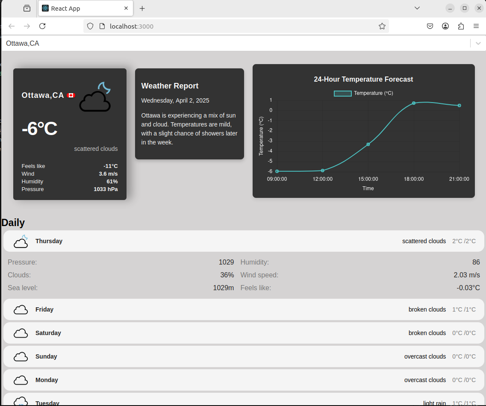

# MyWeather App

MyWeather App is a simple weather application built with React. It allows users to search for a city and view the current weather, a 7-day forecast, and summarized weather news using Gemini AI.

## Features

- Search for a city to get current weather information
- View a 7-day weather forecast
- Get summarized weather news about the searched city
- Responsive design

## Screenshot



## Getting Started

These instructions will get you a copy of the project up and running on your local machine for development and testing purposes.

### Prerequisites

You need to have the following installed on your machine:

- [Node.js](https://nodejs.org/)
- [npm](https://www.npmjs.com/)

### Installing

1. Clone the repository:

```bash
git clone https://github.com/yourusername/myweather-app.git
```

2. Navigate to the project directory:

```bash
cd myweather-app
```

3. Install the dependencies:

```bash
npm install
```

### Running the App

To start the development server, run:

```bash
npm start
```

Open [http://localhost:3000](http://localhost:3000) to view it in your browser. The page will reload when you make changes. You may also see any lint errors in the console.

### Backend Server

This project includes a backend server that uses **Gemini AI** to collect weather news about the searched city and summarize it.

#### Starting the Backend Server

1. Navigate to the backend server directory:
   ```bash
   cd backend-server
   ```

2. Install the backend server dependencies:
   ```bash
   npm install
   ```

3. Start the backend server:
   ```bash
   node server.mjs
   ```

The backend server will run on [http://localhost:5000](http://localhost:5000).

#### Backend Server Functionality

- The backend server uses **Gemini AI** to fetch weather-related news for the searched city.
- It summarizes the news into a concise format and sends it to the frontend.
- Ensure you have a valid **Gemini API key** configured in the `.env` file of the backend server.

### Running Tests

To launch the test runner in the interactive watch mode, run:

```bash
npm test
```

### Building the App

To build the app for production to the `build` folder, run:

```bash
npm run build
```

It correctly bundles React in production mode and optimizes the build for the best performance. The build is minified, and the filenames include the hashes. Your app is ready to be deployed!

### Deployment

For more information on how to deploy the app, see the [Create React App documentation](https://facebook.github.io/create-react-app/docs/deployment).

## Built With

- [React](https://reactjs.org/) - The web framework used
- [OpenWeatherMap API](https://openweathermap.org/api) - Weather data provider
- [GeoDB Cities API](https://rapidapi.com/wirefreethought/api/geodb-cities) - City data provider
- [Gemini AI](https://generativelanguage.googleapis.com/) - AI-powered weather news summarization

## Contributing

Please read [CONTRIBUTING.md](CONTRIBUTING.md) for details on our code of conduct and the process for submitting pull requests.

## License

This project is licensed under the MIT License - see the [LICENSE.md](LICENSE.md) file for details.

## Acknowledgments

- Hat tip to anyone whose code was used
- Inspiration
- etc